# 基于springboot的课程作业管理系统

<h4 style='color:red'>联系不到我，就看我的主页 </h4> 
 
#### 介绍
本系统旨在通过信息化手段，为高校课程和作业管理提供一个高效、便捷、安全的综合管理平台。系统采用Springboot框架开发，具备高度的灵活性和扩展性，能够满足管理端、教师端和学生端的多方需求，提升整体的教学管理效率和质量。

#### 技术栈介绍

后端技术栈：Springboot+Mysql+Maven

前端技术栈：Vue+Html+Css+Javascript+ElementUI

开发工具：Idea+Vscode+Navicate

#### 系统功能介绍

1. 管理端功能模块

个人中心：管理员可以管理个人信息，包括查看和修改个人资料，修改登录密码等，确保个人信息的准确性和安全性。

公告信息管理：管理员可以发布和管理系统公告，确保重要信息及时传达给所有用户。

班级管理：管理员可以创建、编辑和删除班级信息，方便班级的管理和维护。

学生管理：管理员可以管理学生信息，包括新增、修改、删除和查询学生资料，保持学生档案的完整性和准确性。

教师管理：管理员可以管理教师信息，包括新增、修改、删除和查询教师资料，确保教师档案的完整性。

课程类型管理：管理员可以定义和管理课程类型，方便课程分类和检索。

课程信息管理：管理员可以管理课程信息，包括课程的新增、修改、删除和查询，确保课程信息的完整性和准确性。

学生选课管理：管理员可以管理学生的选课信息，审核选课申请，确保选课过程的规范和有序。

作业布置管理：管理员可以布置和管理课程作业，确保作业信息的及时发布和管理。

作业提交管理：管理员可以查看和管理学生的作业提交情况，确保作业提交的及时性和准确性。

作业评分管理：管理员可以管理作业评分情况，确保评分过程的公平和公正。

课程评价管理：管理员可以查看和管理课程评价信息，了解课程教学质量和学生反馈。

课程资源管理：管理员可以管理课程资源，包括课件、视频等教学资源，方便教师和学生的使用。

2.教师端功能模块

个人中心：教师可以管理个人信息，包括查看和修改个人资料，修改登录密码等，确保个人信息的准确性和安全性。

课程信息管理：教师可以管理自己的课程信息，包括课程内容的编辑和更新。

学生选课管理：教师可以查看选课学生的信息，了解学生的选课情况。

作业布置管理：教师可以布置课程作业，确保作业要求的清晰和及时发布。

作业提交管理：教师可以查看和管理学生的作业提交情况，确保作业提交的及时性和准确性。

作业评分管理：教师可以对学生的作业进行评分，提供反馈，确保评分的公平和公正。

课程评价管理：教师可以查看学生对课程的评价，了解教学效果和学生反馈。

课程资源管理：教师可以上传和管理课程资源，包括课件、视频等，方便学生的学习和使用。

3.学生端功能模块

个人中心：学生可以管理个人信息，包括查看和修改个人资料，修改登录密码等，确保个人信息的准确性和安全性。

公告信息管理：学生可以查看系统公告，了解最新的通知和信息。

课程信息管理：学生可以查看课程信息，了解课程内容和要求。

学生选课管理：学生可以进行选课操作，选择自己感兴趣和需要的课程。

作业布置管理：学生可以查看教师布置的作业，了解作业要求和截止日期。

作业提交管理：学生可以提交作业，确保作业提交的及时性和准确性。

作业评分管理：学生可以查看作业评分和教师反馈，了解自己的作业成绩。

课程评价管理：学生可以对课程进行评价，提供反馈，帮助提升教学质量。

课程资源管理：学生可以查看和下载课程资源，包括课件、视频等，方便学习和复习。

#### 系统功能作用

1. 对管理端的作用

高效的信息管理：通过系统化的信息管理，管理员可以方便地维护学生、教师和课程的各类信息，大幅提升工作效率，减少人为操作的错误。

规范的作业管理：统一管理作业的布置、提交和评分过程，确保作业管理的规范和高效
。
全面的课程资源管理：集中管理课程资源，方便教师上传和学生下载，提升教学资源的利用率。

2. 对教师端的作用

便捷的课程管理：教师可以高效地管理课程信息和学生选课情况，集中精力于教学内容的准备和授课。

高效的作业管理：通过系统布置和管理作业，教师可以随时查看作业提交情况，及时评分并提供反馈，提升作业管理效率。

透明的课程评价：教师可以了解学生对课程的评价，及时调整教学方法，提升教学质量。

3. 对学生端的作用

便捷的选课和作业提交：学生可以随时查看课程信息，进行选课操作，并通过系统提交作业，简化操作流程，提升学习体验。

及时的作业反馈：学生可以及时查看作业评分和教师反馈，了解自己的学习情况，改进学习方法。

全面的课程资源获取：学生可以方便地获取课程资源，利用系统提供的学习资料进行课外复习和自学。

#### 系统功能截图

数据库表

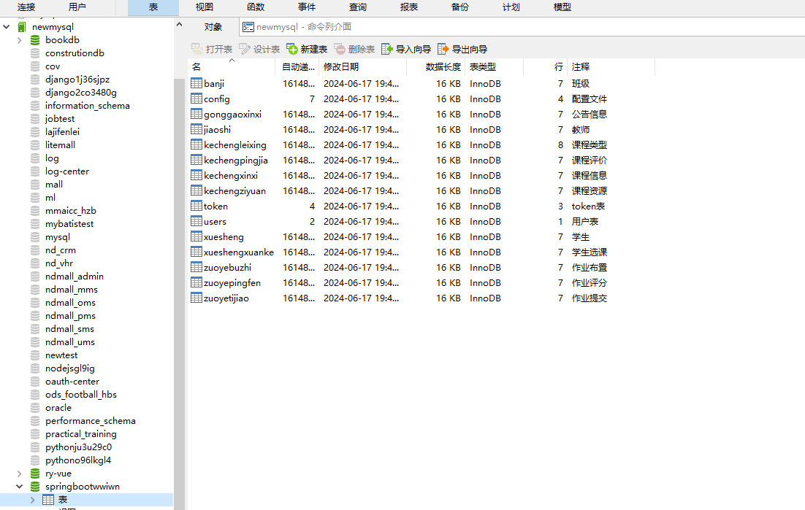

代码结构

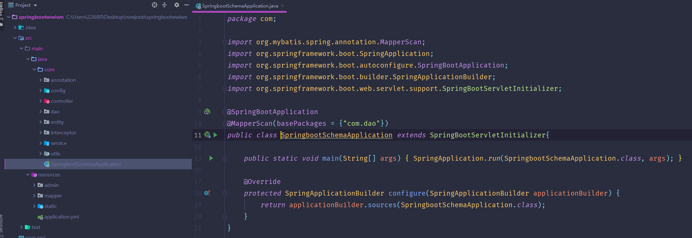

登录

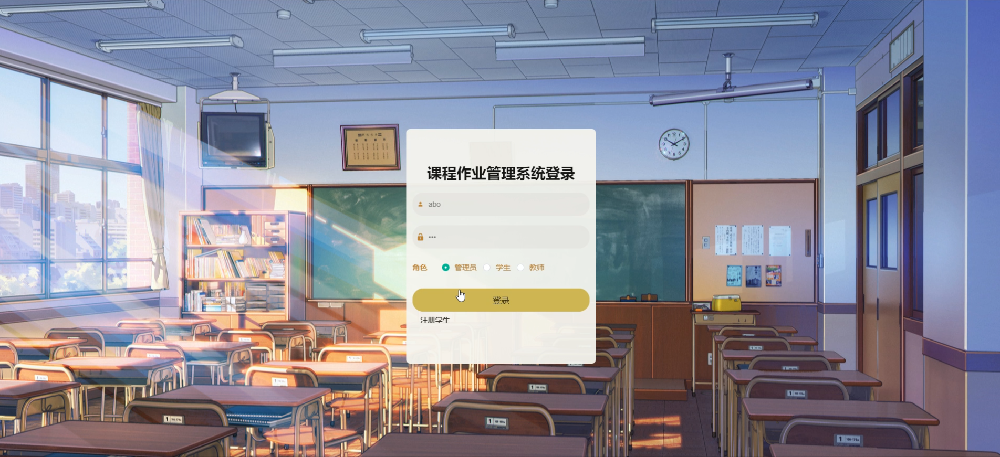

首页

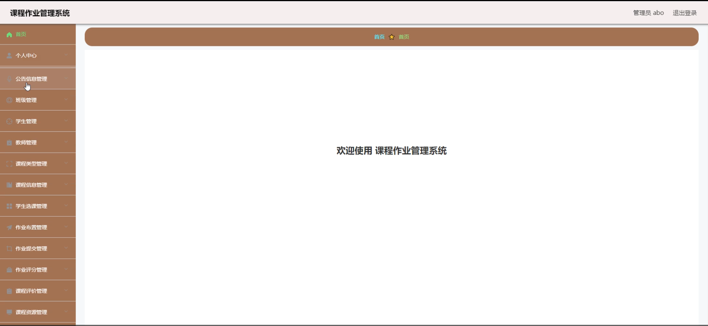

公告信息

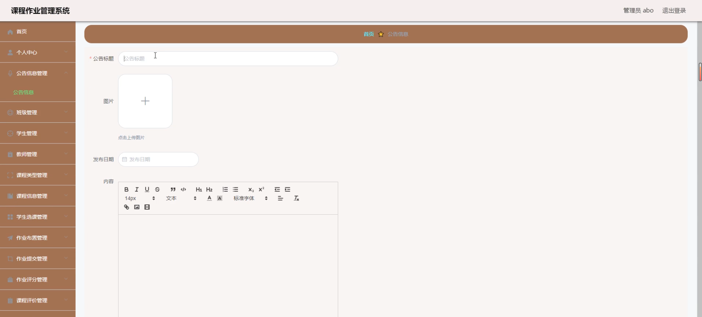

班级管理

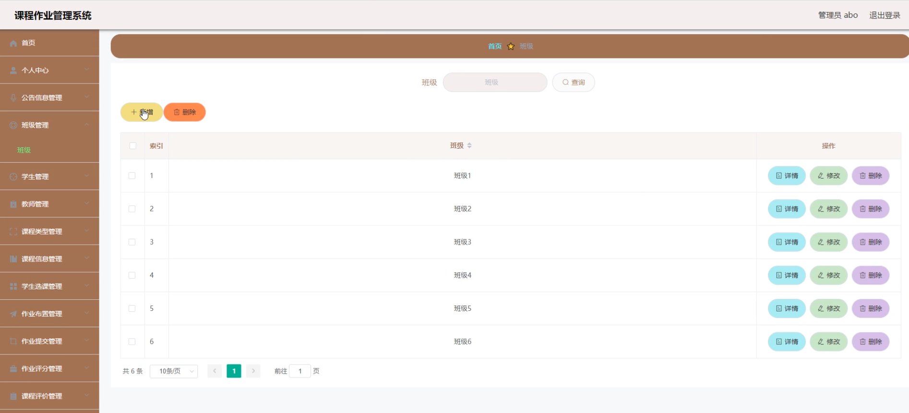

课程类型管理

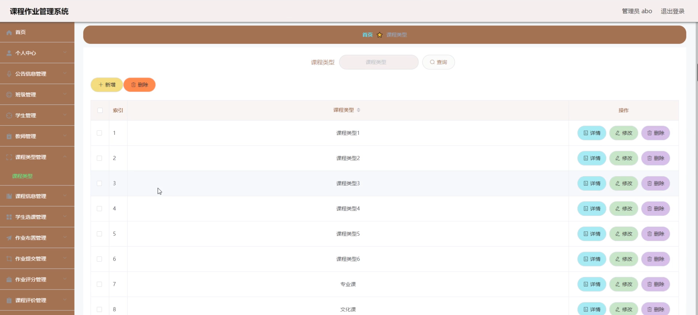

课程信息管理

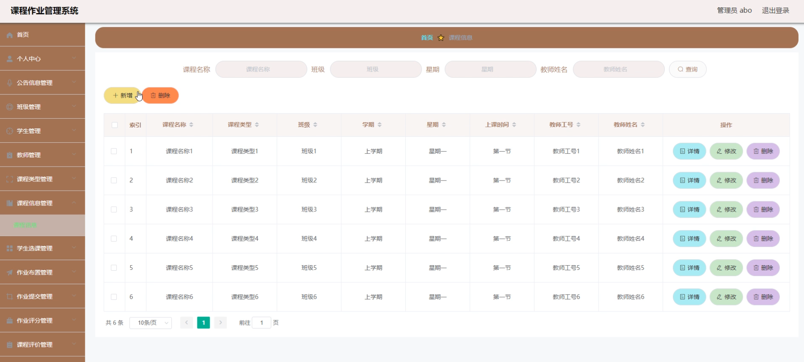

作业布置管理

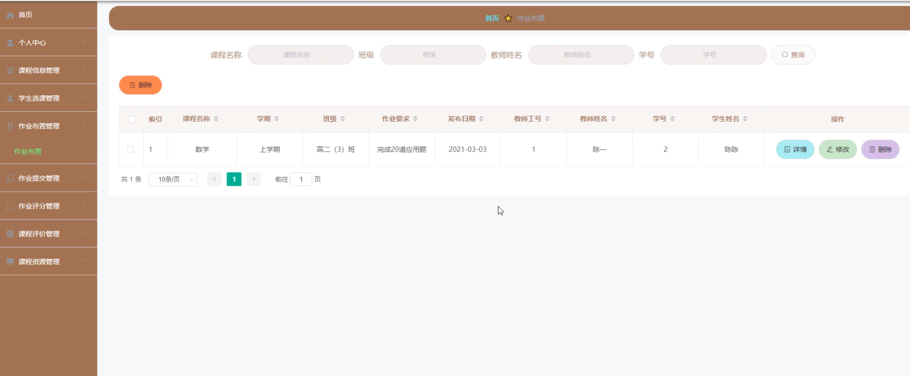

学生选课

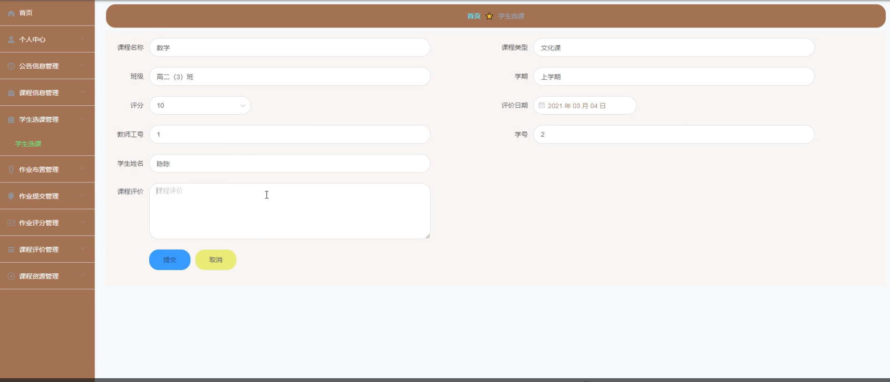

课程资源管理

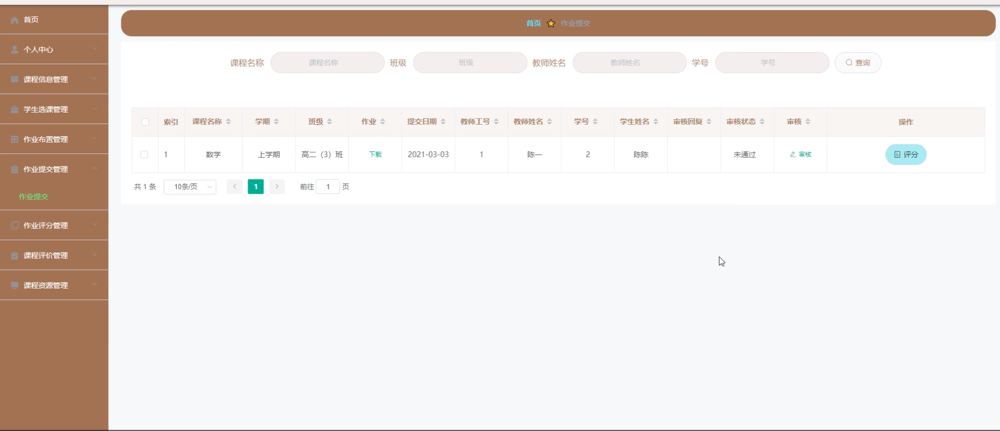

作业提交管理

作业评分

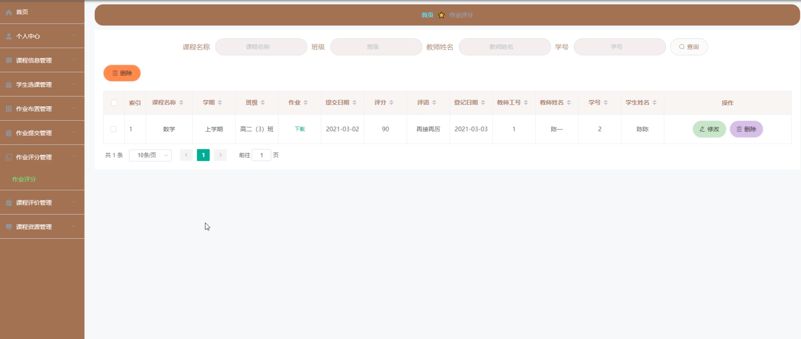

课程评价

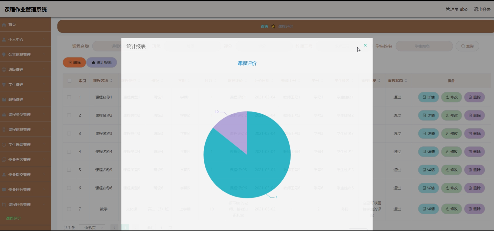

#### 总结

本课程作业管理系统通过信息化手段，实现了管理端、教师端和学生端的全面功能覆盖，满足了各类用户的需求。系统的高效、便捷、安全的特点，不仅提升了教学管理的效率和质量，还通过规范化的管理流程，确保了信息的准确性和透明度。未来，本系统将继续优化和扩展功能，为高校课程管理提供更优质的服务。

#### 使用说明

创建数据库，执行数据库脚本 修改jdbc数据库连接参数 下载安装maven依赖jar 启动idea中的springboot项目

后台地址：http://localhost:8080/springbootwwiwn/admin/dist/index.html

管理员  abo 密码 abo
